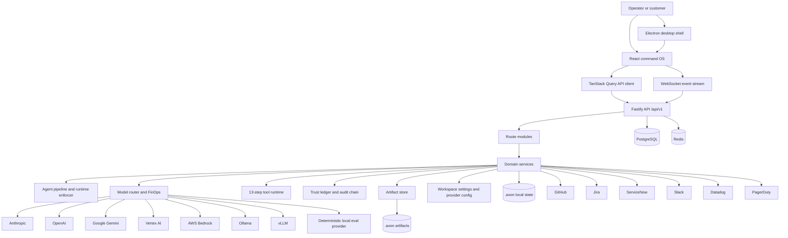
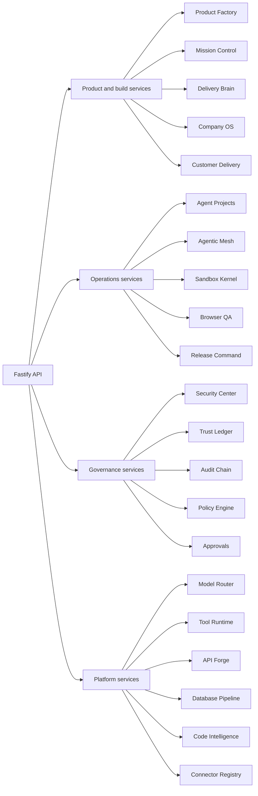
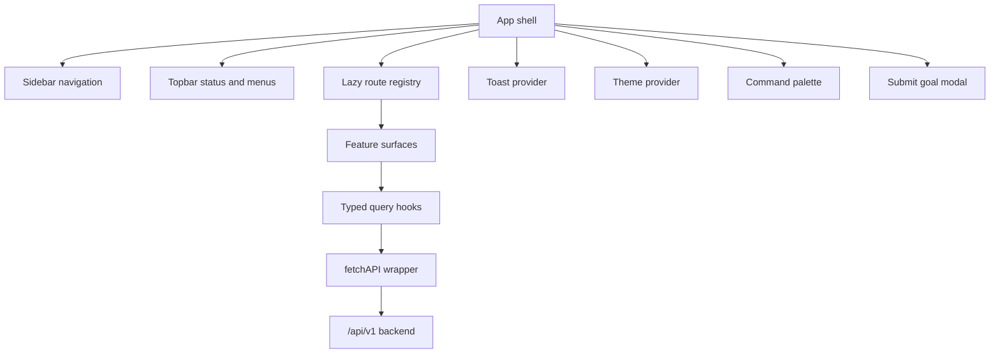
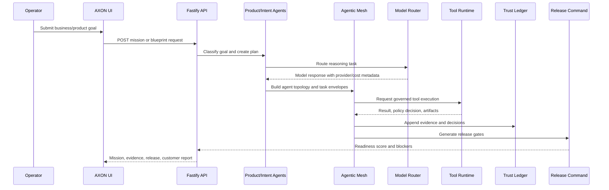
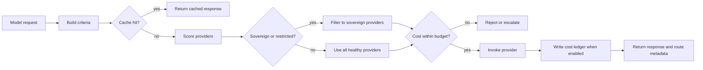
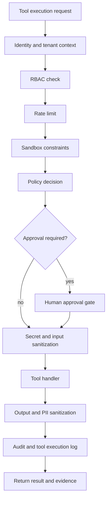
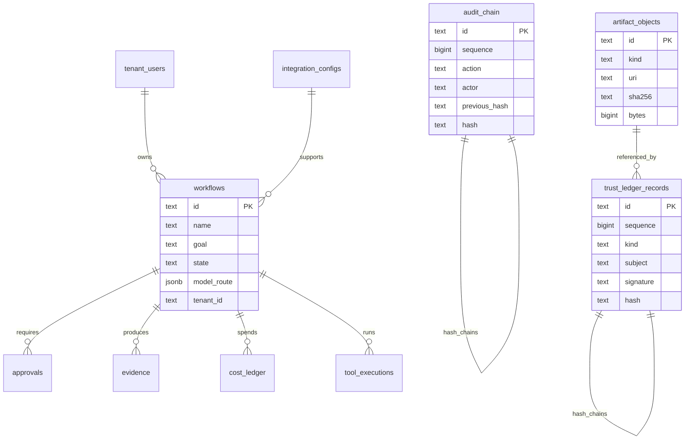

# AXON IT Agentic OS

AXON IT Agentic OS is an AI-powered software delivery operating system. It turns business goals into governed product plans, agentic work execution, validation evidence, release decisions, and customer handoff packages.

The project is built as a full-stack command OS: a React web application, a Fastify backend, an Electron desktop shell, a model/provider router, a tool execution runtime, and production-readiness services for real IT delivery workflows.

> Status: active engineering build. The application runs end-to-end in local development, supports degraded mode when PostgreSQL is not running, and includes production-readiness checks that block unsafe external claims when required runtime foundations are missing.

## Contents

- [Product Scope](#product-scope)
- [Core Capabilities](#core-capabilities)
- [Architecture](#architecture)
- [Data Flow](#data-flow)
- [Agentic Runtime](#agentic-runtime)
- [Security Model](#security-model)
- [Project Structure](#project-structure)
- [Technology Stack](#technology-stack)
- [Local Development](#local-development)
- [Configuration](#configuration)
- [Database](#database)
- [Backend API](#backend-api)
- [Frontend Surfaces](#frontend-surfaces)
- [Desktop App](#desktop-app)
- [CLI](#cli)
- [Validation](#validation)
- [Production Readiness](#production-readiness)
- [Documentation](#documentation)
- [Contributing](#contributing)
- [License](#license)

## Product Scope

AXON is designed for teams that want AI agents to behave like a managed IT delivery organization rather than a single chat assistant. It focuses on:

- Product discovery and system design.
- Agent team planning and delivery orchestration.
- Secure tool execution and approval gates.
- Model/provider routing with cost controls.
- Database migration safety.
- API connector generation and integration planning.
- Browser QA, release command, trust ledger, and customer handoff.
- Desktop and web operator experience.

The goal is not to hide risk behind automation. The system makes risk, evidence, approvals, runtime health, and missing production foundations visible.

## Core Capabilities

| Area | Capability | Primary Surfaces |
| --- | --- | --- |
| Company operating model | Build a 200k-agent style IT operating mission with budget, compliance, workforce plan, and execution controls. | Company OS, Autonomous Workforce |
| Product factory | Convert a product/service request into backlog, estimates, architecture, traceability, and execution steps. | Build Studio, Blueprint Lab |
| Mission orchestration | Connect product planning, agent mesh, FinOps, database review, browser QA, security, release, and delivery. | Mission Control |
| Agentic mesh | Build multi-agent topologies with planner, executor, critic, PMO, security, QA, SRE, data, and release agents. | Agentic FinOps, Delivery Brain |
| Agent projects | Manage scoped agent workspaces, schedules, hooks, delivery packs, execution jobs, and PR handoff packages. | Agent Projects |
| Model routing | Route work across Anthropic, OpenAI, Google, Vertex AI, Bedrock, Ollama, vLLM, and deterministic local eval replay. | Models, Cost, Evaluation Lab |
| Tool runtime | Enforce sandbox, RBAC, rate limiting, policy, secret redaction, audit, and result sanitization on every tool call. | Tools, Safety Pipeline |
| Database safety | Review SQL migrations for lock risk, rollback planning, backup readiness, and production rollout gates. | Database Pipeline |
| API forge | Plan typed SDKs, CLI, MCP contracts, docs, and connector evidence from OpenAPI-style product APIs. | API Forge |
| Security and governance | Scan secrets, dependencies, unsafe changes, policy decisions, evidence, and tamper-evident trust records. | Security, Trust Ledger, Audit |
| Release and QA | Package browser QA, release gate score, evidence snapshot, customer report, and rollback plan. | Preview QA, Release Command |
| Managed service delivery | Build ITSM, SLA, customer success, account, project, and service desk operating plans. | Managed Services, Customer Delivery, Service Desk |

## Architecture

### System Topology



### Backend Service Boundaries



### Frontend Architecture



## Data Flow

### Goal to Delivery Flow



### Model Routing and Cost Control



### Tool Execution Flow



### Persistence Model



## Agentic Runtime

AXON models IT delivery as cooperating specialist agents:

- IntentAgent: converts raw user goals into classified work.
- StackResearchAgent: gathers architecture and market/technology signals.
- SolutionArchitectAgent: creates system designs and tradeoff plans.
- EngineeringAgent: plans implementation and code changes.
- QAAgent: defines browser, regression, and acceptance evidence.
- SecurityAgent: checks secrets, dependencies, data risks, and release blockers.
- MigrationSafetyAgent: reviews database migrations and rollback plans.
- SREAgent: reasons about reliability, incidents, and operational handoff.
- FinOpsAgent: chooses cheaper routes, cache policies, and escalation gates.
- CriticAgent: evaluates plans, outputs, and risk claims.
- PMOAgent: converts delivery into milestones, owners, and status.
- ReleaseAgent: gates production release, rollback, and customer evidence.
- ComplianceAgent: maps work to controls and ledger records.

The runtime uses explicit plans, task envelopes, approval gates, evidence artifacts, and trust records so the agent system behaves more like an auditable IT organization than an unrestricted chat loop.

## Security Model

Security is handled across the shell, API, runtime, and evidence layers.

| Layer | Controls |
| --- | --- |
| Desktop shell | Context isolation, disabled Node integration, sandboxed renderer, restricted navigation, preload bridge. |
| API | CORS, Helmet, input validation with Zod, typed route modules, structured errors. |
| Tool runtime | RBAC, rate limiting, sandbox controls, allow/deny decisions, approval gates, secret redaction, output sanitization. |
| Model routing | Provider health checks, sovereign routing, budget checks, deterministic offline eval harness. |
| Database | Migration review pipeline, bounded health checks, PostgreSQL schema constraints and indexes. |
| Audit | Hash-chained audit records and trust ledger records with signing hooks. |
| Secrets | Environment-based local development, provider key configuration, encrypted storage readiness via AXON_CONFIG_SECRET. |

Security-sensitive production claims are intentionally blocked by Production Readiness until the runtime foundations are configured.

## Project Structure

```text
.
|-- src/                       React command OS
|   |-- app/
|   |   |-- components/        Shell, topbar, sidebar, UI primitives
|   |   |-- lib/               Public query facades, routing, websocket, store, toast
|   |   |   `-- queries/       Domain query modules grouped by API surface
|   |   |-- surfaces/          Product, ops, governance, platform screens
|   |   |   `-- agent-projects/ Agent Projects view and panels
|   |   `-- routes.tsx         Lazy route registry
|-- backend/                   Fastify API and agent runtime
|   |-- src/
|   |   |-- agents/            Agent definitions, pipeline, runtime enforcer
|   |   |-- agent-projects/    Product factory orchestration and workspace runtime
|   |   |   |-- execution/     Execution fabric, delivery jobs, workspace execution
|   |   |   `-- packaging/     Delivery packs, hooks, PR packages, run recaps
|   |   |-- models/            Provider router, cache, eval harness
|   |   |-- tools/             Governed tool runtime and implementations
|   |   |-- routes/            /api/v1 HTTP routes
|   |   |-- db/                PostgreSQL connection, schema, migration, seed
|   |   |-- integrations/      ServiceNow, Jira, PagerDuty, Datadog, Slack, GitHub
|   |   |-- services/          Shared audit, RBAC, policy, memory, durable store
|   |   `-- *-service/         Domain modules for product, release, QA, etc.
|-- electron/                  Desktop shell
|-- scripts/                   AXON CLI helper scripts
|-- tests/e2e/                 Playwright browser audits
|-- docker-compose.yml         PostgreSQL and Redis for local runtime
|-- package.json               Root frontend, desktop, test, and orchestration scripts
`-- backend/package.json       Backend scripts and dependencies
```

Small root-level facade files are kept intentionally where existing imports depend on them; larger implementation files live inside the feature folders above.
Generated and local-only folders such as `dist/`, `backend/dist/`, `.axon/`, `backend/.axon/`, `node_modules/`, `docs/`, and test output folders must not be committed. The `docs/` directory is currently treated as local/internal planning material and is ignored by git; the public architecture overview lives in this README.

## Technology Stack

| Layer | Technology |
| --- | --- |
| Frontend | React 18, TypeScript 5.7, Vite 6, React Router 7, TanStack Query 5, Radix UI, Tailwind CSS 4, lucide-react |
| Backend | Node.js 20+, Fastify 5, TypeScript 5.7, Zod, postgres.js, pgvector-ready schema, WebSocket gateway |
| Desktop | Electron 42 with secure main/preload separation |
| Data | PostgreSQL 17, Redis 7, local `.axon` durable state fallback |
| AI providers | Anthropic, OpenAI, Google AI Studio, Vertex AI, AWS Bedrock, Ollama, vLLM, deterministic local eval provider |
| Testing | Vitest, Playwright, TypeScript compiler, ESLint |
| DevOps | Docker Compose local services, GitHub/GitLab CI configuration, build scripts |

## Local Development

### Requirements

- Node.js `>=20.18.1`
- npm
- Docker Desktop or a compatible Docker runtime, for PostgreSQL/Redis

### Install

```bash
npm install
cd backend
npm install
cd ..
```

### Environment

```bash
copy .env.example .env
copy backend\.env.example backend\.env
```

Then fill provider keys and production adapter values only when needed.

### Start the full web app

```bash
npm run dev:all
```

Web app:

```text
http://localhost:5173
```

Backend API:

```text
http://localhost:3001/api/v1
```

Backend service index:

```text
http://localhost:3001/
```

### Start infrastructure

```bash
npm run db:up
npm run db:migrate
npm run db:seed
```

If PostgreSQL is not running, the API still starts in degraded mode and the frontend shows DB readiness as degraded.

## Configuration

Important environment variables:

| Variable | Purpose |
| --- | --- |
| `VITE_API_URL` | Frontend API base URL. |
| `VITE_WS_URL` | Frontend WebSocket URL. |
| `DATABASE_URL` | PostgreSQL connection string. |
| `CORS_ORIGIN` | Allowed frontend origin. |
| `AXON_STATE_DIR` | Local durable state directory. |
| `AXON_ARTIFACT_DIR` | Local artifact directory. |
| `AXON_LEDGER_SIGNING_KEY` | Trust Ledger signing secret for local development. |
| `AXON_CONFIG_SECRET` | Local credential encryption secret. |
| `ANTHROPIC_API_KEY` | Anthropic provider key. |
| `OPENAI_API_KEY` | OpenAI provider key. |
| `GOOGLE_API_KEY` | Google AI Studio provider key. |
| `AWS_REGION`, `AWS_ACCESS_KEY_ID`, `AWS_SECRET_ACCESS_KEY` | AWS Bedrock route configuration. |
| `GCP_PROJECT_ID`, `GCP_LOCATION` | Vertex AI route configuration. |
| `OLLAMA_BASE_URL` | Local Ollama route. |
| `VLLM_BASE_URL` | Private vLLM route. |
| `MODEL_PROVIDER_MOCK` | Force deterministic local model provider for dev/eval. |

See [.env.example](.env.example) and [backend/.env.example](backend/.env.example) for the complete set.

## Database

Local services are defined in [docker-compose.yml](docker-compose.yml):

- PostgreSQL 17 on port `5432`
- Redis 7 on port `6379`

Schema source:

```text
backend/src/db/schema.sql
```

The schema covers:

- Workflows, agents, approvals, alerts, incidents.
- Policies, evidence, memory records, cost ledger.
- Hash-chained audit records.
- Tool execution logs.
- Tenant users.
- Integration configs.
- Trust ledger records.
- Artifact manifests.

## Backend API

All application data routes are under:

```text
/api/v1
```

Common route families:

| Route family | Purpose |
| --- | --- |
| `/health` | Live/readiness checks and degraded DB state. |
| `/settings` | Workspace, security, notification, provider, and skill settings. |
| `/models` | Provider catalog, provider config, health, invoke, stream, eval report. |
| `/tools` | Tool registry, pipeline, stats, and governed execution. |
| `/integrations` | Connector runtime status and configuration. |
| `/agent-projects` | Agent project templates, dispatch, jobs, hooks, PR packages. |
| `/mission-control` | End-to-end delivery missions. |
| `/production-readiness` | Production service readiness reports and activations. |
| `/trust-ledger` | Tamper-evident records and policy decisions. |
| `/database-pipeline` | SQL migration safety reviews. |
| `/release-command` | Release gates, evidence snapshots, and status. |
| `/browser-qa` | Preview/browser QA plans and evidence packages. |
| `/security-center` | Security scan and release blocker analysis. |
| `/api-forge` | API/SDK/MCP connector package planning. |

The backend root `/` returns a service index with the API base, health URLs, and key entry routes.

## Frontend Surfaces

The route registry is in [src/app/routes.tsx](src/app/routes.tsx). Current surfaces include:

- Company OS
- Mission Control
- Market Radar
- Trust Ledger
- Agentic FinOps
- Agent Projects
- Production Readiness
- Delivery Brain
- Structure Guardian
- Build Studio
- Enterprise OS
- Release Command
- Preview QA
- Security
- Checkpoints
- Service Desk
- Managed Services
- Customer Delivery
- API Forge
- Skill Academy
- Autonomous Workforce
- Ops Overview
- Workflows
- Agents
- Memory
- Policies
- Evidence
- Incidents
- Cost
- Executive
- Execution DAG
- Terminal
- Chat
- Audit Trail
- Models
- Blueprint Lab
- Integrations
- Evaluation Lab
- Tools
- Code
- Safety Pipeline
- Database
- Settings

Playwright route audit coverage is in [tests/e2e/routes.spec.ts](tests/e2e/routes.spec.ts).

## Desktop App

Development desktop shell:

```bash
npm run desktop:dev
```

Production desktop shell:

```bash
npm run desktop:start
```

The Electron shell waits for:

```text
http://localhost:5173
http://localhost:3001/api/v1/settings
```

Security posture:

- Context isolation enabled.
- Node integration disabled in renderer.
- Renderer sandbox enabled.
- Navigation restricted to the local app origin.
- Preload bridge used for safe desktop metadata.

## CLI

The project includes an AXON CLI wrapper:

```bash
npm run axon -- templates
npm run axon -- projects
npm run axon -- dispatch --launch --autonomy supervised
npm run axon -- queue-job --run apr_x --browser
npm run axon -- run-job --job job_x
npm run axon -- job-events --job job_x
npm run axon -- runtime-profile --project apj_x --run apr_x
npm run axon -- run-hook --project apj_x --event loop-stop --approved
npm run axon -- pr-package --run apr_x --execution apx_x
npm run axon -- fabric-plan --run apr_x --provider github-actions --deploy vercel --env staging --budget 30 --pr
npm run axon -- fabric-run --plan xfp_x --approved --live --secrets GITHUB_TOKEN,VERCEL_TOKEN
npm run axon -- browser-evidence --execution apx_x --url http://localhost:5173
npm run axon -- recap --run apr_x
npm run axon -- delivery-pack --execution apx_x
npm run axon -- sdk-manifest
```

Live execution fabric submissions require explicit provider credentials and approval-oriented environment variables. Keep live adapters disabled until reviewed.

## Validation

Run the complete local validation suite:

```bash
npm run typecheck
npm run lint
npm test -- --run
npm run test:e2e
npm run build
cd backend
npm run build
cd ..
```

Expected checks:

- TypeScript passes for frontend and backend.
- ESLint passes with zero warnings.
- Vitest passes backend/service/unit route coverage.
- Playwright smoke test passes.
- Playwright all-route audit passes.
- Frontend and backend production builds complete.

## Production Readiness

Production Readiness intentionally separates "the code runs" from "the platform is safe to sell or operate for customers."

Before external production use, verify:

- PostgreSQL and Redis are running in managed, backed-up environments.
- Migrations are applied and monitored.
- Artifact storage is durable, not only local `.axon/artifacts`.
- Trust Ledger signing uses KMS/HSM-backed keys.
- Provider keys are stored in an approved secrets manager.
- SSO/OIDC is configured for operators.
- Browser QA worker is enabled for real screenshots/videos/traces.
- Deployment adapters are configured for the target environment.
- Live execution adapters are explicitly reviewed and approved.
- Production Readiness status is `production-loop-ready`.

Local readiness endpoints:

```text
GET http://localhost:3001/api/v1/health/live
GET http://localhost:3001/api/v1/health/ready
GET http://localhost:3001/api/v1/production-runtime/status
GET http://localhost:3001/api/v1/production-readiness/reports
```

## Documentation

This README is the public architecture and operating guide. Local long-form planning notes may exist under `docs/`, but that folder is ignored by git and should not be pushed unless the project explicitly decides to publish those documents later.

## Contributing

Read [CONTRIBUTING.md](CONTRIBUTING.md) before changing code. At minimum:

- Keep the canonical project layout: `src/`, `backend/`, `electron/`, `scripts/`, `tests/`.
- Do not recreate duplicate root projects.
- Do not commit `.env`, `.axon/`, `dist/`, `backend/dist/`, `docs/`, or `node_modules/`.
- Run the validation suite for the layer you touched.
- Add or update tests for backend route/service behavior and frontend route regressions.
- Keep security, audit, and production-readiness claims evidence-backed.

## License

AXON IT Agentic OS is open source under the Apache License 2.0. See [LICENSE](LICENSE). The npm package manifests may remain marked `"private": true` only to prevent accidental registry publishing; that does not change the repository license.
